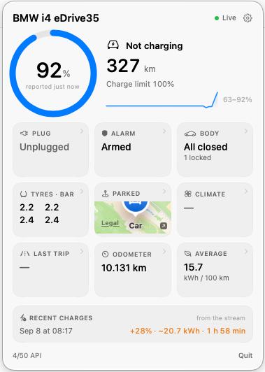
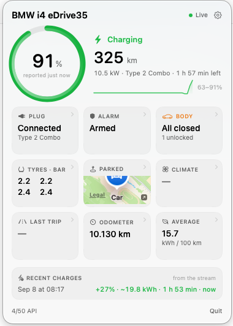

# bmw-bar

A macOS status bar monitor for a BMW i4, built on **BMW CarData**.

Shows charge level, charging status, power, time remaining, charge limit, electric
range and plug state — updating live over BMW's MQTT stream.

**Idle**



**Charging**



## What this can and cannot do

**It cannot start or stop charging, and it cannot change the charge limit.**

On 2025-09-29 BMW blocked third-party access to the MyBMW app API. `bimmer_connected`,
the library behind essentially every BMW integration, is now archived and published to
PyPI as *"Deprecated/Non-functional"* — its `trigger_charge_start` and
`trigger_charging_settings_update` no longer work.

The official replacement, BMW CarData, is **read-only**. Every vehicle endpoint in
BMW's own OpenAPI spec is a `GET`; the only writes manage which telemetry fields you
subscribe to:

```
GET    /customers/vehicles/mappings
GET    /customers/vehicles/{vin}/basicData
GET    /customers/vehicles/{vin}/telematicData
GET    /customers/vehicles/{vin}/chargingHistory
GET    /customers/vehicles/{vin}/locationBasedChargingSettings
GET    /customers/vehicles/{vin}/smartMaintenanceTyreDiagnosis
GET    /customers/vehicles/{vin}/image
GET/POST/DELETE  /customers/containers[/{id}]     # data subscriptions, not commands
```

The only surviving remote-charge-control path is BMW's B2B Energy API (resold by
partners such as Smartcar): business contract, AC-only, geofenced to ~200 m of a
consented address, capped at 80 stop commands per rolling 30 days — and it still
cannot set the charge limit.

The charge limit **is readable**, so the app displays it. It just can't change it.

## Requirements

- macOS 14+
- Swift 6 toolchain (Xcode.app not required — Command Line Tools are enough)
- A BMW account with CarData available (EU) and the car mapped to you as PRIMARY

## BMW portal setup

This part cannot be automated. Do it before first launch.

1. Sign in to MyBMW ([DE](https://www.bmw.de/de-de/mybmw/vehicle-overview) ·
   [UK](https://www.bmw.co.uk/en-gb/mybmw/vehicle-overview)), pick the car, choose
   **BMW CarData**.
2. Generate a **Client ID**. **Do not press "Authenticate device"** in the portal —
   the app runs that flow itself.
3. Click **Request access to CarData API**, wait ~60 s.
4. Click **Request access to CarData Stream**, wait ~60 s.
   Rushing these two steps is the usual cause of 403s later.
5. Open **Configure data stream**, click "Load more" until every descriptor is listed,
   and **tick everything**. Streaming is not metered, so there's no cost to enabling
   more than you think you need, and the app quietly ignores whatever it doesn't use.
   If you'd rather be selective, these four block core features (the charge percent,
   the ring's limit tick, and the range readout):
   - `vehicle.drivetrain.batteryManagement.header`
   - `vehicle.powertrain.electric.battery.stateOfCharge.displayed`
   - `vehicle.powertrain.electric.battery.stateOfCharge.target`
   - `vehicle.drivetrain.electricEngine.kombiRemainingElectricRange`

   Two real-world catches, both cases of BMW's catalogue not matching what the car
   actually sends — treat the catalogue as a starting point, not ground truth:
   - A BMW i4 streams `vehicle.drivetrain.lastRemainingRange` for its range instead of
     the descriptor above, despite the catalogue listing that id as ICE/PHEV/MHEV only,
     not BEV. The app subscribes to both and uses whichever reported most recently.
   - `charging.method` documents its range as `AC_TYPE1PLUG, AC_TYPE2PLUG, NOCHARGING`,
     but a real i4 charging on a CCS inlet sends `AC_TYP2COMBO`, which is in none of
     them. Unlisted plug values are tidied into readable names rather than dropped.
6. Save.

The portal's streaming selection is separate from anything the app does — a field only
starts arriving after you tick it here, and some fields (trip stats, charging power)
only ever populate while the car is actually in that state, so give it a charge or a
drive before concluding something is missing.

## Build and run

```bash
make app        # builds build/BMWBar.app
make run        # builds and launches it
make test       # runs the test suite
make smoke      # launches the real bundle and asserts it finishes starting up
make logs       # follows the running app's own logging
```

`make smoke` exists because of a bug no unit test could catch: a `TimelineView` placed
in the `MenuBarExtra` **label** wedged SwiftUI inside `MenuBarExtraController.updateButton`,
blocking the main thread so `applicationDidFinishLaunching` never returned. Everything
compiled, all tests passed, and the app silently never connected to anything. The smoke
target launches the bundle and asserts the app logs `ready:`.

The app logs to `os_log` under the subsystem `com.ohoefenstock.bmw-bar`, with categories
`app`, `stream`, `polling` and `api` — a status bar app has nowhere to print, and
without this the stream and the poll leave no trace at all. No tokens are logged.

On first launch the panel walks you through pasting the Client ID and approving this
Mac in the browser.

## Headless CLI

Every layer is reachable without the UI, which is how the app is verified against real
BMW servers:

```bash
swift run BMWBar --cli auth --client-id <id>     # device code flow
swift run BMWBar --cli whoami                    # stored session (offline)
swift run BMWBar --cli setup                     # resolve VIN + telemetry container (REST)
swift run BMWBar --cli status                    # one REST snapshot (1 API call)
swift run BMWBar --cli stream                    # follow the live feed (free, zero calls)
swift run BMWBar --cli mood                      # colour + motion for each vehicle state
swift run BMWBar --cli render panel.png          # render the dashboard to an image (no network)
swift run BMWBar --cli notify-test               # post a sample notification (bundled app only)
swift run BMWBar --cli quota                     # today's API budget (offline)
swift run BMWBar --cli containers                # list/delete telemetry containers
swift run BMWBar --cli signout
```

## Two BMW quirks that cost real debugging time

**Descriptor ids must be exact.** BMW fails a whole container creation with
`CU-402 Telematic key is invalid` if *any* single descriptor is unknown or deprecated.
`Scripts/fetch-catalogue.sh` snapshots BMW's published catalogue, and
`DescriptorCatalogueTests` asserts every id the app uses is in it. Run the script if
BMW ever retires one.

Also note the two charging-status descriptors use **different vocabularies** for the
same concept — `status` says `CHARGINGACTIVE`/`NOCHARGING`/`CHARGINGENDED`, while
`hvStatus` says `CHARGING`/`NOT_CHARGING`/`FINISHED_FULLY_CHARGED`. Either can read
`UNKNOWN`/`INVALID`, so the app subscribes to both and uses whichever is informative.

**The streaming broker is TLS 1.3-only.** A TLS 1.2 ClientHello gets alert 70
(`protocol_version`); via CocoaMQTT's stock socket that surfaces as the opaque
SecureTransport error -9836. CocoaAsyncSocket's `startTLS` uses SecureTransport, which
Apple never gave TLS 1.3, so no `sslSettings` tweak helps — the transport is replaced
with `NetworkFrameworkSocket`, an `NWConnection`-based implementation of
`CocoaMQTTSocketProtocol`. You can confirm the constraint yourself:

```bash
echo | openssl s_client -connect customer.streaming-cardata.bmwgroup.com:9000 -tls1_2
```

## The dashboard

Everything is on one surface — no disclosures, no hidden sections. A fixed 3×3 grid of
tiles (plug, alarm, body, tyres, parked map, climate, last trip, odometer, average) sits
under the charge ring, and every tile renders even when its data has never arrived,
showing "—" instead of disappearing. A stable layout is what makes it readable at a
glance. Settings, the one thing that isn't data, live behind the gear.

Every tile is a door into a **detail panel** — click through for the reading behind the
summary: all four tyre pressures against their targets, every door and window
individually, the full charging supply breakdown, a pannable map. Escape or the chevron
goes back.

To see any screen without a running app or screen recording:

```bash
swift run BMWBar --cli render panel.png                   # your real cached state
swift run BMWBar --cli render --charging panel.png        # synthetic charging state
swift run BMWBar --cli render --detail body panel.png     # a specific detail panel
```

`--detail` takes `body`, `tyres`, `charging`, `security`, `location`, `climate` or
`trip`. MapKit and `Link` don't draw inside `ImageRenderer`, so the map and the
"Open in Maps" row appear blank in a render but are fine in the app.

## Closed is not locked

The Body panel shows opening state and lock state as separate columns, because BMW
reports them for different points. Of **245 catalogued descriptors, exactly two concern
locking**: `body.trunk.isLocked` and `body.flap.isLocked`. So:

| Point | Open / closed | Locked |
|---|---|---|
| Doors ×4 | yes | **never reported** |
| Windows ×4 + tailgate glass | yes, incl. an `INTERMEDIATE` "ajar" state | never reported |
| Boot | yes | yes — the only point with both |
| Bonnet | yes | never reported |
| Charge flap | never reported | yes |

There is no central-locking descriptor at all. The alarm's arm state is the closest
proxy, and the app labels it "Armed" rather than claiming the doors are locked. In
practice on a real i4 the boot lock has never streamed either, leaving the charge flap
as the only live lock reading — so a tile saying "All closed · 1 unlocked" is usually
telling you about the charge flap.

## What it shows

Beyond charge state: tyre pressures against their targets, what is open (doors,
windows, boot, bonnet), alarm arm state, parked location with an Open-in-Maps link,
preconditioning, and last-trip consumption. All of it streamed, none of it metered.

A 24-hour charge sparkline and a **local charging-session log** are built from the
stream as it arrives — start/end, SoC gained, duration, and kWh integrated from the
power curve. That replaces BMW's REST `chargingHistory` endpoint entirely: higher
resolution, unlimited retention, zero calls.

> **There is no central door-lock descriptor in BMW's catalogue** — only the boot and
> charge flap report lock state. The app shows the alarm's arm state, which BMW sets
> when you lock, and labels it "Armed" rather than claiming to know the doors are
> locked.

## Colour and motion

State is readable before any text is parsed, and motion is reserved for things actually
happening — a resting car is completely still.

| State | Accent | Motion |
|---|---|---|
| Charging | green | A highlight flowing around the ring |
| Preconditioning | teal | A slow halo breathing behind it |
| Both | green ring, teal halo | Layered |
| Charge finished | green | One pulse, then still |
| Paused / interrupted | amber | Two pulses, then still |
| Error | red | Two pulses, then still |
| Resting | accent | None |

One-shot pulses come from the same detector that raises the notifications, so a banner
and its matching flash can never disagree. `Reduce Motion` turns continuous motion into
a static tint, and colour is never the only signal — every accent carries an icon and
words. The menu bar icon deliberately never animates.

Inspect the mapping without waiting for the car:

```bash
swift run BMWBar --cli mood
```

BMW streams only a *target* cabin temperature, never an ambient or current reading, so
heating and cooling cannot be told apart — preconditioning gets one accent, not two.

## Notifications

Charging events raise native macOS notifications. All are toggleable in the panel
under **Notifications**:

| Event | Fires when |
|---|---|
| Charging started | The car begins drawing current |
| Charging finished | Distinguishes "stopped at your charge limit" from "battery full" |
| Charging interrupted | Paused, errored, or stopped while still plugged in |
| Plugged in but not charging | Cable in, nothing happening after 5 minutes |
| Battery at *n*% | Charge crosses a threshold you set, once per session |
| Car left open | A door, window, boot or bonnet newly opens |
| Alarm triggered | The anti-theft alarm goes off |
| Tyre pressure low | A tyre drops below target by your margin |
| Preconditioning finished | The cabin should be ready (off by default) |

The last one is the point of the feature for most people: a cable seated wrong or a
wallbox that never authorised means coming back to an empty car. Unplugging is
deliberately *not* reported as an interruption, and a car sitting on a finished charge
is not reported as idle.

Detection is a pure function of state transitions
([ChargingEvent.swift](Sources/BMWBarKit/Notifications/ChargingEvent.swift)), separate
from delivery, so the tricky parts — staying silent on the launch baseline, not
repeating on every sparse stream message — are covered by tests rather than guesswork.

Notifications need the bundled app (`UNUserNotificationCenter` requires a bundle
identifier). To verify delivery:

```bash
build/BMWBar.app/Contents/MacOS/BMWBar --cli notify-test
```

## Memory and back-pressure

A status bar app runs all day, so the message path is written to stay flat. Measured on
a real charging session: **74 MB resident, 17 MB footprint, stable**.

Three things keep it there, each of which was a genuine hazard:

- **Nothing rebuilds the status item on a timer.** A `TimelineView` in the
  `MenuBarExtra` *label* once put SwiftUI into a runaway loop inside
  `MenuBarExtraController.updateButton` — a sampled stack showed 942 of 1653 samples
  parked there, on the main thread. It blocked `applicationDidFinishLaunching`, so the
  app never started, and allocated continuously while doing it. The charge estimate is
  ticked on `AppModel` instead and the label is a plain view. `make smoke` guards this.
- **The stream buffer is bounded.** `AsyncStream`'s default policy is `.unbounded`, and
  BMW genuinely sends bursts — 82 messages in a single second has been observed, one per
  descriptor. Paired with a consumer doing file I/O, that is an unbounded queue behind a
  slow reader. It is now `.bufferingNewest(512)`.
- **The consumer does no per-message disk work.** It previously re-read and re-parsed
  the entire 90-day sample log *and* re-encoded the whole state file on every message.
  Samples are now appended in memory within a bounded window, and state writes are
  coalesced to at most one every two seconds (and flushed on teardown).

The parked-location map also no longer carries `.id(coordinate)`, which was rebuilding
an entire MapKit view every time the car moved.

## Things worth knowing

- **Nothing is fetched at startup — a normal install makes zero API calls, ever.** The
  VIN is discovered from the stream's wildcard topic (`{gcid}/+`), and no telemetry
  container is created at launch — containers only ever feed the REST snapshot
  endpoint, which the app doesn't call unless asked to. The dashboard's last known
  values come from `state.json` on disk, and the stream corrects them from there.
- **Streaming is the data source, not REST.** BMW's own guidance: *"The use of the
  CarData APIs is subject to a daily rate limit of 50 requests… If you require more
  frequent access to your vehicle data, we recommend utilizing the CarData streaming
  solution."* Every ongoing update here arrives over MQTT, which is not metered.
- **REST exists only for the explicit "Fetch snapshot now" button** in Settings (and the
  equivalent `--cli setup` / `--cli status` on the command line). Pressing it resolves
  the VIN and telemetry container if they aren't already cached (~3 calls, once) and
  pulls one snapshot (1 call) — both labelled with their cost. Nothing else in the app
  spends from the 50/day budget.
- The 50/day cap is BMW's, not a setting here. They publish no rate-limit headers and
  no quota endpoint, so `QuotaTracker` keeps a local mirror; when BMW returns `CU-429`
  that is treated as authoritative over the local count. The 5-call reserve for
  essential requests *is* a local choice (`QuotaTracker.reserve`).
- **One MQTT connection per account.** If Home Assistant, evcc, or a second copy of
  this app is already streaming, BMW refuses this one with `notAuthorized` even though
  the token is valid. The panel says so explicitly and retries every 5 minutes rather
  than treating it as an auth failure.
- **Polling happens only while charging.** That is the only time the number moves on its
  own, so it is the only time a fetch buys anything — a parked car polled all day would
  spend the whole 50-call budget to learn it is still parked. Confining it that way is
  what makes a short interval affordable: at the default 15 minutes a charge costs about
  4 calls an hour (~12 for a three-hour charge), and an idle day costs nothing at all.
  The fetches are also deliberately **non-essential**, so they stop at the 5-call reserve
  and can never starve a manual "Fetch now", and they refuse to run before setup has
  cached a container so a poll can never trigger first-time setup you didn't ask for.
  Toggle and interval live in Settings.
- **CarData is event-driven, and this matters most while charging.** The car publishes
  when something *happens* — locked, plugged in, charge started — not on a clock. A
  charge level quietly climbing is not an event. Observed on a real i4: 22 minutes of
  active charging with **no message at all**, then locking the car from the MyBMW app
  released a burst revealing the charge had gone 64% → 69% the whole time. The MyBMW
  app looks live only because opening it wakes the vehicle and queries it; the stream
  never does that, and no amount of reconnecting changes it.

  So the charge is **extrapolated between reports** — energy in = power × time,
  converted to percent via the pack's usable capacity, clamped at the charge limit.
  Against that real 22-minute gap the model predicted 70.0% where the car later said
  69%, about a point high since it ignores charging losses and BMW reports whole
  percents. It is never presented as a reading. The ring carries the whole story: the
  estimate prefixed with `~`, and beneath it the car's own last figure and how old it
  is — `~87%` over `was 82% · 20m ago`. When nothing is being estimated that line just
  reads `reported 4m ago`. Any real reading replaces the estimate immediately.
- **The car reports when it chooses to.** Values are push-based, so the panel shows
  when the reading is from rather than implying it is live. Waking the car (locking or
  unlocking from the MyBMW app) usually triggers an update.
- **Tokens** live in `~/Library/Application Support/bmw-bar/tokens.json`, mode 0600.
  The Keychain would be the more obvious home, but an ad-hoc-signed app gets a new code
  signature on every rebuild and macOS then prompts for the login password each time.
  Set `BMW_BAR_STORAGE=keychain` to opt in once the app is signed with a stable
  identity.
- **Refresh tokens rotate on every use** and last two weeks. `TokenStore` serialises
  refreshes so two concurrent ones can't spend each other's token.
